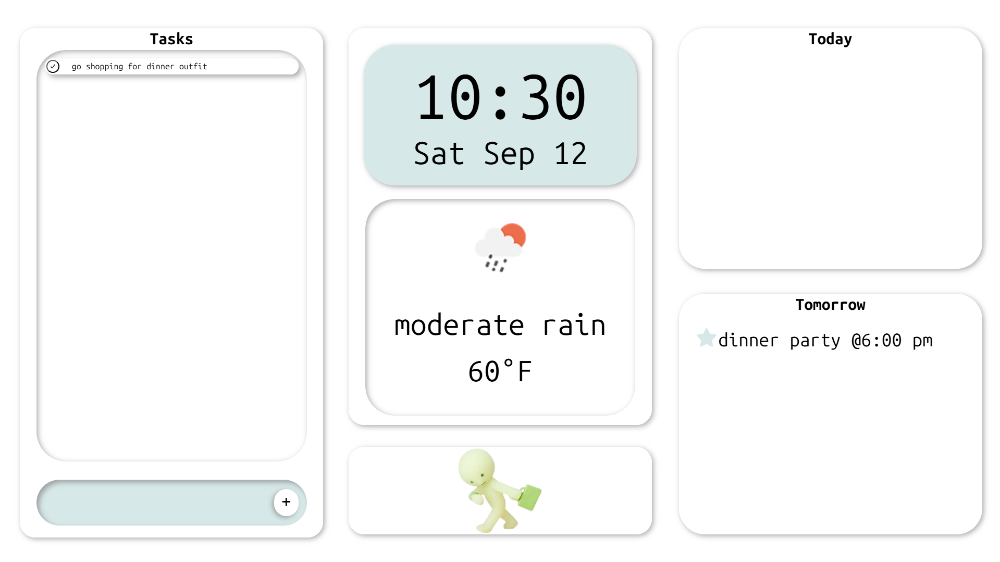
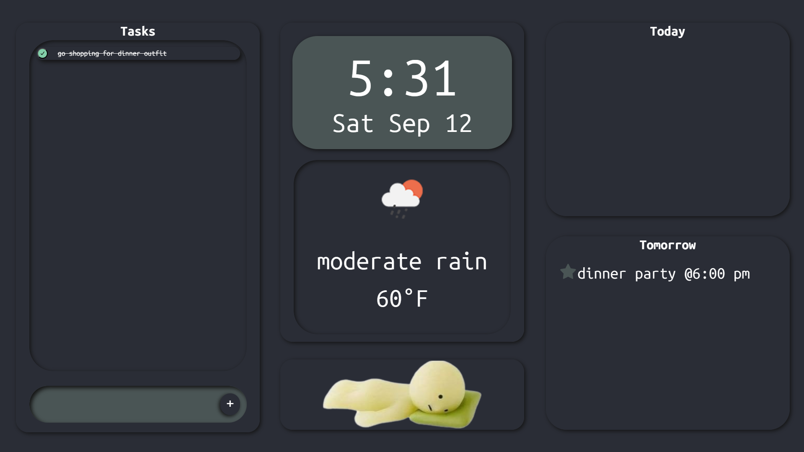

#  Personal Dashboard

A desktop dashboard app that brings together the things I check every day — to-do list, clock, weather, and calendar — into one clean interface, with data synced across devices via a cloud database. Currently being extended to a custom embedded hardware client.

## Features

- **To-Do List** — add, delete, and complete tasks
- **Live Clock** — always up to date
- **Weather** — auto-refreshing current conditions via OpenWeatherMap
- **Calendar** — Google Calendar integration via OAuth, synced through an IPC bridge to the renderer process
- **Automatic Dark Mode** — switches based on time of day using CSS variables
- **Cross-Device Sync** — to-dos and calendar events sync to Supabase every 30 minutes, so other devices can read the same data
- **Packaged Installer** — built and packaged for Windows using electron-builder

## Tech Stack

- **Frontend/App Shell:** Electron, JavaScript, HTML/CSS
- **Backend/Sync:** Supabase (PostgreSQL)
- **APIs:** Google Calendar API (OAuth2), OpenWeatherMap API
- **Packaging:** electron-builder

## In Progress

- **Keychain Display** — a LilyGO T-Display (ESP32), programmed in C++ via PlatformIO, showing clock/date, and todos/events from supabase,

